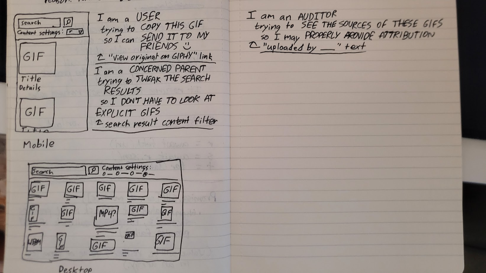

# project-2
### Homebrew Giphy search engine

Capstone project for JavaScript developer boot-camp program. Single-page website that pines for .gifs from the monolithic content creation conglomerate GIPHY, Inc. once owned by Facebook/Meta, now owned by Shutterstock, of all things.

**USAGE**
Type a search query into the box and hit "GO". The content filter setting changes the maximum content rating (g, pg, pg13, or r) that can appear in search results ("Don't care" and "Crass" are functionally identical). Note that this won't limit results to *only* that rating, just that results of that rating *might* appear in the output.

**POSSIBLE IMPROVEMENTS**
- Change how many gifs display
- Gif automatically expands to full size when you mouse over it
- Option to copy a gif as an actual .gif file instead of a .webp (possibly against GIPHY's API terms of use?)

"*SeeFits*" display font created by me (feel free to steal it)

"*Fairfax*" font by thee mighty [Rebecca G. Bettencourt](https://www.kreativekorp.com/software/fonts/fairfax/)

